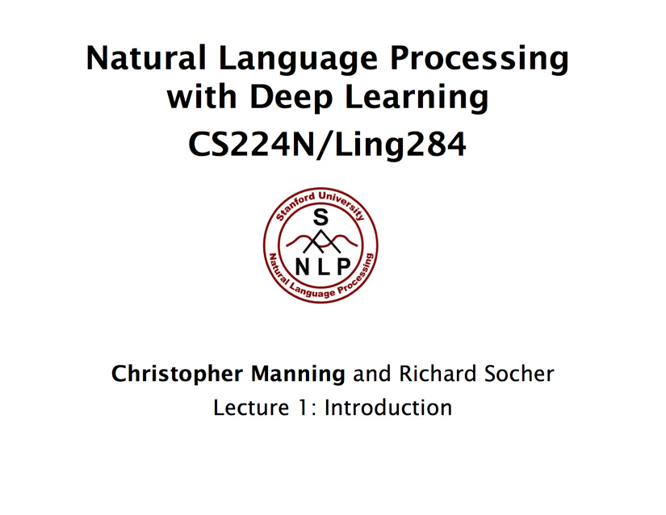
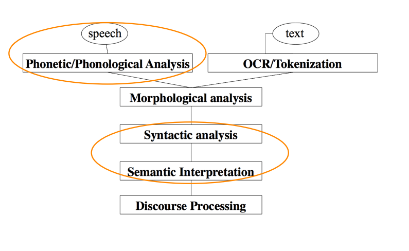
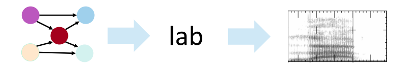
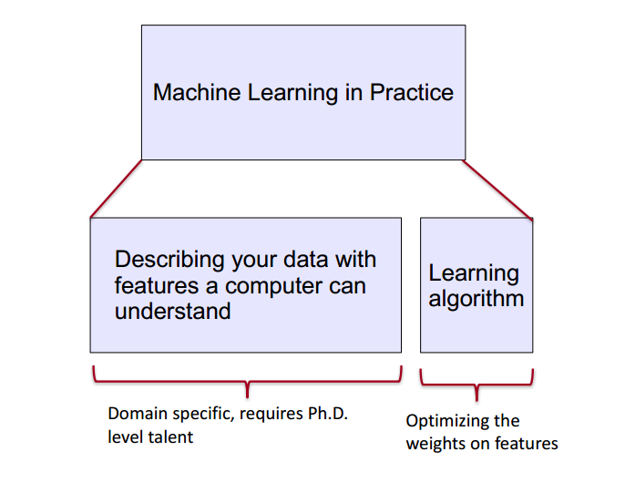
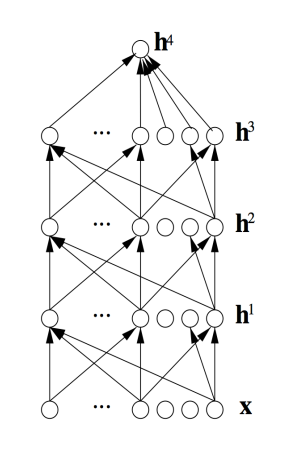
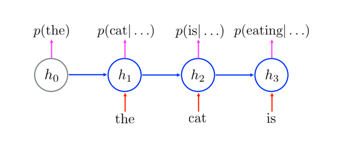
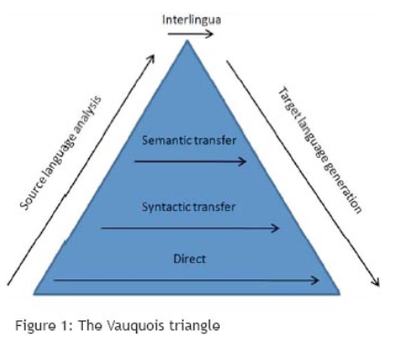
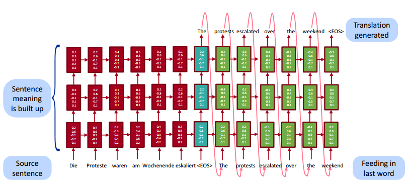

<!-- ## 自然语言处理与深度学习简介 -->
<!-- slide -->

<!-- slide -->
## Natural Language Processing With Deep Learning

__CS224n / Ling284__

__Christopher Manning__ and Richard Socher

Lecture 1: Introduction

<!-- slide -->
### Lecture Plan

1. What is Natural Language Processing？

2. What is Deep Learning?

3. Course logistics

4. Why is language understanding difficult?

5. Intro to the application of Deep Learning to NLP

<!-- slide -->
### 1. What is Natural Language Processing (NLP)?

##### **Natural Language Processing** is a field at the intersction of
  - computer science
  - artifical intelligence
  - and linguistics

<!-- slide vertical=true -->
##### **Goal:** for computers to process or "understand" natural language in order to perform tasks that are useful,e.g.,
  - Performing Tasks, like making appointments, buying things
  - Qustion Answering
    - Siri,Google Assistant,Facebook M,Cortana...thank you,mobile!!!

<!-- slide vertical=true -->
##### Fully **understanding and representing** the **meaning** of language(or even defining it) is a difficult goal.
  - Perfect language understanding is AI-complete

<!-- slide -->
#### NLP Levels

<!-- slide -->
#### (A tiny sample of) NLP Applications
##### Applications range from simple to complex:
  - Spell checking,keyword search,finding synonyms
  - Extracting information form websites such as
    - product price,dates,location,people or company names
  - Classify: reading level of school texts,positive/negative sentiment of longer documents
  - Machine translation
  - Spoken dialog systems
  - Complex question answering

<!-- slide -->
####  NLP in industry ... is taking off
- Search (written and spoken)
- Online adventisement matching
- Automated / Assisted translation
- Sentiment analysis for marketing or finance/trading
- Speech recognition
- Chatbots / Dialog agents
  - Automating customer supoort
  - Controlling devices
  - Ordering goods

<!-- slide -->
#### What's special about human language

##### A human language is a system **spcifically constructed to convey the speaker/writers meaning**
  - Not just an environmental signal,it's a deliberate communication
  - Using an encoding which little kids can quickly learn(amazingly!)

<!-- slide vertical=true -->
##### A human language is a discrete/symbolic/categorical signaling system
  - rokect violin
  - with very minor exceptions for expressive signaling
    ("I loooove it." "Whooomppaaa")
  - presumably because of greater signaling reliability
  - symbols are not just an invention of logic /classical AI!

<!-- slide vertical=true -->
##### the categorical symbols of a language can be encoded as a signal for communication in several ways:
  - sound
  - gesture
  - images(writing)
- the symbols is invarient across different encodings!

<!-- slide vertical=true -->
- a human language is a symolic/categorical signaling system
- however,a brain encoding appears to be a continuous pattern of activation,and the symbols are transmitted vua continuous signals of sounds/vision
- We will explore a continuous encoding pattern of thought
- the large vocabulary, symbolic encoding of words creates a problem for machine learning - sparsity!

<!-- slide -->
### 2. What's Deep Learning(DL)?
#### **Deep Learning** is a subfield of machine learning

<!-- slide vertical=true -->
#### most machine Learning methods work well because of **human-designed representations** and input features
  - for example:features for finding named entities like locations or organization names(Finkel et al.,2010)
  - machine learning becomes just optimizing weights to best make a final prediction

<!-- slide vertical=true -->
#### machine learning vs deep learning

<!-- slide vertical=true -->

- **Representation learning** attempts to automatically learn good features or representations

- **Deep Learning** algorithms attempts to learn(multiple levels of) representation and an output

- From "raw" inputs **x**
  (e.g.,sound,characters,or words)

<!-- slide vertical=true -->

<!-- slide -->
#### On the history of and term "Deep Learning"
- We will focus on different kinds of neural networks
- The dominant model family inside deep learning
- Only clever terminology fot sy
<!-- slide -->

<!-- slide -->

<!-- slide -->

<!-- slide -->

<!-- slide -->

<!-- slide -->
__Representations of NLP Levels: Semantics__

<!-- slide -->
__NLP Applications: Sentiment Analysis__

<!-- slide -->
__Qustion Answering__

<!-- slide -->
__Dialog agents/Response Generation__
- A simple, successful example is the auto-replies available in the Google Inbox app
- A application of the powerful, general technique of **Neural Language Models**, which are an instance of Recurrent Neural Networks

<!-- slide vertical=true -->

<!-- slide -->
__Neural Machine Translation__
- Many levels of translation have been tried in the past:

<!-- slide vertical=true -->
- Traditional MT systems are very large complex systems
- What do you think is the interlingua for the DL approach to translation?
- Source sentence is mapped to a **vector** ,then output sentence generated
  [Sutskever	et	al.	2014,	Bahdanau	et	al.	2014,	Luong	and	Manning	2016]
<!-- slide vertical=true -->

Now live for some languages in Google Translate(etc.),with big error reductions!

<!-- slide -->
__Conclusion: Representation for all levels? Vectors__

- We will study in the next lecture how we can learn vector representations for words and what they actually **represent**

- Next week: how neural networks work and how they can use these vectors for all NLP levels and many different applications
